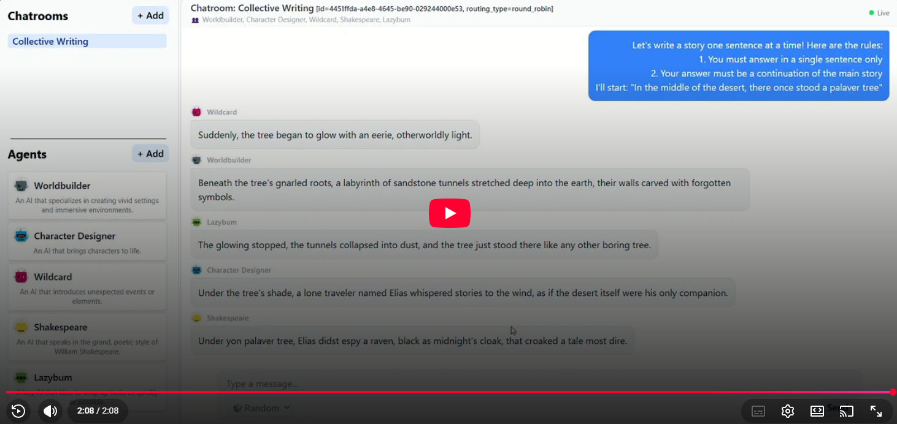

<p align="center">
  
</p>
<p align="center">
  <a href="https://pypi.org/project/palaver/" alt="v0.0.3">
    </a>
  <a href="https://pypi.org/project/palaver/" alt="Python 3.12+">
    </a>
</p>

A true Multi-Agent AI chatroom application.

Create, chat and collaborate with your personal AI agents in a single chatroom. You can let each agent interact with eachother and observe how the chaos unfolds.

## Installation

### Prerequisites
- Python 3.12+

Simply install `palaver` via `pip`
```
> pip install palaver
```

## Usage
Run palaver from the terminal to launch the server
```
> palaver
```

Navigate to [localhost:8000](http://localhost:8000) and start chatting!

Check the [User Guide](./docs/user_guide.md) for more detailed info.

## Demos
[](https://www.youtube.com/watch?v=YxM43pE2Y7E&list=PLle1PavqJapCoYEveaQ2s2Mf6YF8QojHe)

---
<a href="https://www.star-history.com/?repos=CisterMoke%2Fpalaver&type=date&legend=top-left">
 <picture>
   <source media="(prefers-color-scheme: dark)" srcset="https://api.star-history.com/image?repos=CisterMoke/palaver&type=date&theme=dark&legend=top-left" />
   <source media="(prefers-color-scheme: light)" srcset="https://api.star-history.com/image?repos=CisterMoke/palaver&type=date&legend=top-left" />
   
 </picture>
</a>
