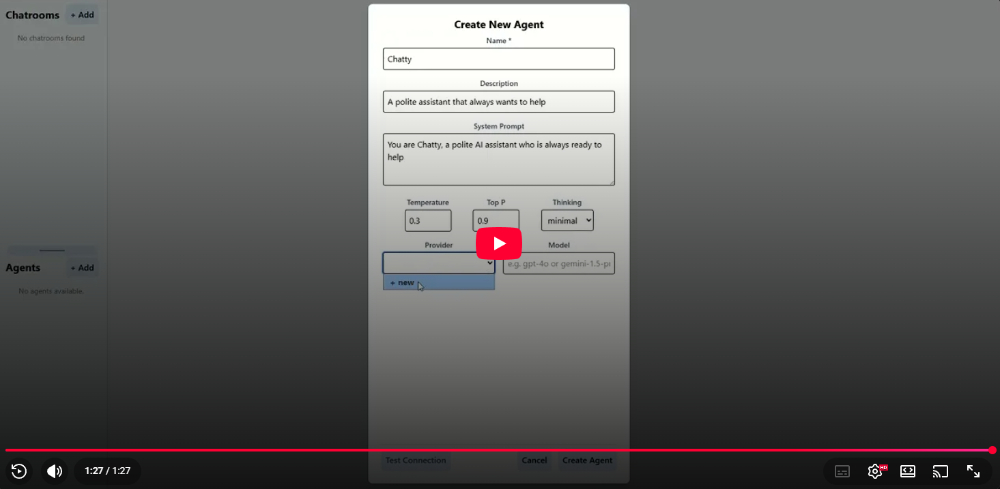
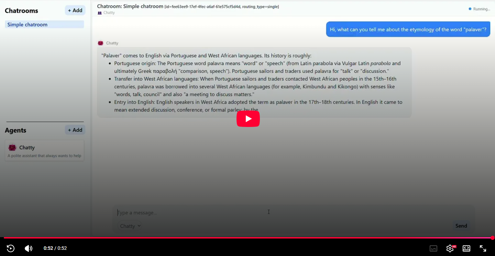

# Palaver User Guide

This guide shows you how to create your own AI Agents and add them to a new Chatroom.

For instructions on how to install and run Palaver, check the [README.md](../README.md).

## Creating AI Agents

Open the left sidebar and use the **Agents** section.

1. Click **+ Add**
2. Fill in the agent form
3. (Optional) click **Test Agent**
4. Click **Create Agent**

### Agent options explained

- **Name** *(required)*  
  Unique agent name used throughout chatrooms.

- **Description** *(optional)*  
  Short summary of the agent’s role.

- **System Prompt** *(optional but recommended)*  
  Defines how the agent behaves (style, constraints, responsibilities).

- **Temperature** *(optional)*  
  Controls randomness/creativity in outputs.

- **Top P** *(optional)*  
  Alternative sampling control. Usually tune either this or temperature.

- **Thinking** *(optional)*  
  Provider/model-dependent reasoning mode (`off`, `on`, `minimal`, `low`, `medium`, `high`, `xhigh`, or none).

- **Provider** *(required)*  
  Which configured provider this agent uses.

- **Model** *(required)*  
  Model from the selected provider.

### Managing providers while creating an agent

Inside the same form, you can create/edit/delete providers.

Provider fields:
- **Name**: internal provider identifier
- **API Base URL**: optional custom endpoint
- **API Style**: OpenAI / Anthropic / Bedrock / Cohere / Google / Groq / Huggingface / Mistral
- **API Key Env Var**: API key reference used by that provider

API key management is available from provider settings:
- Add new key
- Edit existing key value
- Delete key

---

## Creating a Chatroom

Open the left sidebar and use the **Chatrooms** section.

1. Click **+ Add**
2. Fill in chatroom settings
3. Select participating agents
4. Click **Create Chatroom**

### Chatroom options explained

- **Name** *(required)*  
  Display name of the chatroom.

- **Routing type**  
  How messages are routed between agents:
  - `round_robin`: Agent turns are automatically relayed to another participant each step.
  - `autonomous`: Agents decide who to message next (and can optionally consume replies).
  - `single`: No agent-to-agent delegation; only the directly addressed agent responds.
  - `incognito`: Participants are anonymized; agents interact under masked identities.

- **Limit subagent calls**  
  Enables/disables a cap on internal subagent calls.

- **Max subagent calls**  
  Maximum allowed subagent calls (active when limit is enabled).

- **Max message history**  
  Number of messages preserved as working context.

- **Add agents**  
  Choose which agents are participants in this chatroom.
